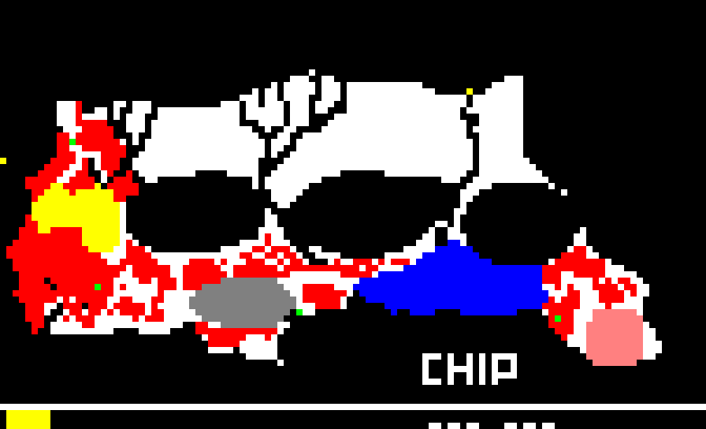
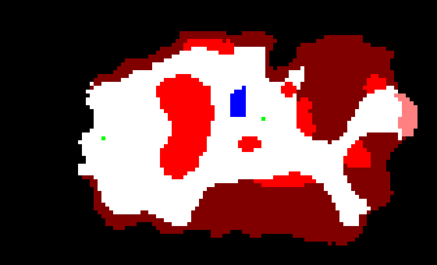

# Journey to the Center of the Earth (1988, DOS) reverse engineering

Journey to the Center of the Earth is a 1988 shovelware title released by CHIP on multiple platforms,
including MS-DOS, that can be best described as a shitty Jules Verne-themed ripoff of The Oregon Trail.
It features trial-and-error gameplay, a PC speaker sound playback routine that someone was way too proud of,
and JPEGs by Eric Chahi.

This game has been featured on Kusogrande several times (it's how I got introduced to it), and it's
fascinating in how bad it is, but I'm not sure if anyone ever figured out how the game works
(possibly because it sucks), so I decided to reverse engineer it as a change of pace from wrangling
with MIPS assembly.

## The basics

The game flow goes like this:

1. The game displays a character select screen, where, of course, you pick your character.
   Each character has different statistics internally, which I'll describe in a bit.

2. Once you pick your character the game goes through an introductory sequence where it displays some
   expository text, then throws you directly into the rockfall minigame. If you don't survive that,
   then it's game over and the loop starts over, otherwise you continue on to the game.

3. The main game screen shows your character's vital statistics, a list of actions you can take,
   and directions in which you can travel. When you pick a direction, the game will move you once cell
   inside one of the game's invisible maps (either the main map or the lake map; we'll get to those in
   a second), then takes some action depending on random rolls and the type of cell you stepped onto.
   This repeats either until you die or the game decides you've won, which is achieved by escaping the
   ruins on the lava raft.

4. If you win the game, it goes into an infinite loop and halts (great game design).
   If you don't, it starts you over from the beginning.

The two maps are stored in JOURNEY.EXE at 0x16BFC. The upper four bits are for the main map, and the lower
four bits are for the lake map. The map is 112 cells wide and 68 cells tall.

## The characters

The currently selected character ID is stored at 0x6A66. The characters are:

- 1: Erik Gunnarson.
- 2: Louis Bourdon. 
- 3: Francis Rutherford.
- 4: Antonio Rossi.
 
General facts:
- Gunnarson and Rutherford will take 100 damage from the mammoths; Bourdon and Rossi will take 200 damage.
- Gunnarson and Rossi will take 50 damage from the crocs; Bourdon and Rutherford will take 100 damage.
- Gunnarson and Rossi will take at least 100 damage from falling rocks; Bourdon and Rutherford will take
  at least 200 damage. Big rocks will deal 300 damage regardless of character.
- The pterodactyls will always deal 100 damage.
- When sleeping, Gunnarson and Rossi will recover 100 health for every 6 hours they sleep,
  so 6 hours will recover 100 health and 24 hours will recover 400 health.
  Bourdon recovers 300 health if he sleeps either for 18 or 24 hours. Rutherford
  needs 18 hours of sleep to recover 200 health, and 24 hours of sleep to recover 300 health;
  he will recover 100 health if he sleeps for 6 or 12 hours.

## Food, water and other stuff

178e:001e calculates resource consumption and other stuff per turn.

0x6a78 is how much water you have.

The game will subtract a portion of food and water on every turn, and, if you go below zero for
those items, it will take that out of your health instead.

## Randomness

Randomness is based off the system date and time (shocker!) and advanced by different events.

Important functions:
- 1000:021d generates the random number.
- 1ff6:0000 sets the RNG seed.
- 1ff6:0011 advances the random number generator and returns the result of the last roll.
- 1fa3:000f reads the system date (INT 21h with AH=0x2A).
- 1fa3:0025 reads the system time (INT 21h with AH=0x2C).
- 2019:0042 demunges the system date/time into something that can be used to seed the RNG.

Randomness is affected by the following events (among others):
- Drawing a textbox (it picks a random color for most of them)
- Rocks falling in the rockfall and ruins minigames
- A very large function at 178e:0609
- Mammoths appearing in the mammoth minigame
- End-of-turn vital statistics updates (applied by 19ec:000e)
- End-of-turn injury randomness
- End-of-turn chance of an instant kill if all extremities are injured
- Direction in which the lava raft rocks back and forth on the final lava escape minigame
- Danger cell behavior: checking if you'll be dealing with mammoths, rockslides, pterodactyls, crocodiles...
- Difficulty level selection when starting the rockfall minigame (excluding the rockfall minigame
  at the start of each game)
- Crocodiles appearing in the crocodile minigame

The RNG is re-seeded when:
- Moving in a direction on foot or on the raft
- Starting the rockfall minigame
- Starting the mammoth minigame
- Starting the water collection minigame
- Displaying one of the travel messages
- Entering the main game loop after the first rockfall minigame has been played
- Starting the crocodile minigame

Random events are:
- When you enter a danger cell, the game gives you a 70% chance of playing the minigame. This is true for
  all of the danger cells on both the main and lake maps.

- Random injuries are rolled at the end of most turns when travelling on the main map. There is a 60% chance you
  will not get injured, a 30% chance you suffer a minor injury, and a 10% chance you suffer a major injury.
  (See the function at 19ec:043c.) Additionally, if you still have health remaining, and you are injured on all
  extremities (i.e., the 16-bit words at 0x69A8, 0x69AA, 0x69AC and 0x69AE are all not zero), then the game will
  roll an 80% chance of an instant kill, where you fall to your death.

## The main map

Here is the raw map data (dumped to gamemap.txt):

```
1111111111111111111111111111111111111111111111111111111111111111111111111111111111111111111111111111111111111111
1111111111111111111111111111111111111111111111111111111111111111111111111111111111111111111111111111111111111111
1111111111111111111111111111111111111111111111111111111111111111111111111111111111111111111111111111111111111111
1111111111111111111111111111111111111111111111111111111111111111111111111111111111111111111111111111111111111111
1111111111111111111111111111111111111111111111111111111111111111111111111111111111111111111111111111111111111111
1111111111111111111111111111111111111111111111111111111111111111111111111111111111111111111111111111111111111111
1111111111111111111111111111111111111111111111111111111111111111111111111111111111111111111111111111111111111111
1111111111111111111111111111111111111111111111111111111111111111111111111111111111111111111111111111111111111111
1111111111111111111111111111111111111111111111111111111111111111111111111111111111111111111111111111111111111111
1111111111111111111111111111111111111111111111111111111111111111111111111111111111111111111111111111111111111111
1111111111111111111111111111111111111111111111111111111111111111111111111111111111111111111111111111111111111111
1111111111111111111111111111111111111111111111111021111111111111111111111111111111111111111211111111111111111111
1111111111111111111111111111111111111111111112000220011111111111111111111111111100021111122221111111111111111111
1111111111111111111111111111111111111111111020000020002000000000000111111111110000022222222221111111111111111111
11111111111111111111111111111111111111110200200000200020000000000000011111e1100000022222222221111111111111111111
1111111111111111111111111111111111111100020020000220002000000000000000000020000000022222222221112211111111111111
111111122007d111220020002111111111100020020002000200022000000000000000000020000000022222222221122222111111111111
111111122007d110020220002000000000000020000002000200222000000000000000000200000000022222222222122222111122211111
111111122007d000020200022000000000000020000002000222200000000000000000000222000000022222222222122222111122211111
111111122007ddddd22200020000000000000022200002000222000000000000000000000022000000022222222222222222211222211111
1111111222070ddddd2200020000000000000000220220022220000000000000000000000020000000022222222222222222222222221111
111111222dd7dddddd2220220000000000000000022200220000000000000000000000000022000000022222222222222222222222222111
111111222dd7ddddddd020200000000000000000002000200000000000000000000000000002000000022222222222222222222222222111
111111222cc77dddcddd22200000000000000000002002200000000000000000000000000002000000022222222222222222222222222211
111112222ccc7777ddcd22000000000000000000002022000000000000000000000000000002000000022222222222222222222222222222
e2222222ccdc7c17dcd120000000000000000000022220000000000000000000000000000002000000002222222222222222222222222222
2222222cdcc77c17ddd120000000000000000000022200000000000000000000000000000002000000000222222222222222222222222222
222222dccc77cd117d1152000000000333330000022000000000003333333000000000000022000000000022222222222222222222222222
2222cdccc77cccc1715552200333333333333333020000000003333333333333333333000220000000000002222222222222222222222222
2222cccdeecdccce155555233333333331333333020000000333333333311333333333332200003333333330222222222222222222222222
22221cceeeeceeeeee5555333313333333333333322000003333111133313133333333332000333333333333302222222222222222222222
22221ceeeeeeeeeeee5533333333333333333333332000033333133133313133333333332003333333333333332222222222222222222222
22221eeeeeeeeeeeeee033333333333333333333332200333333111133311133333333322033333333333333333222222222222222222222
22221eeeeeeeeeeeeee033333333333333333333330223333333333333331133333333320033333333333333333222222222222222222222
22225eeeeeeeeeeeeee033333333331333333333330022333333333333333333113333320333333333333333333322222222222222222222
222255eeeeeeeeeeeee033333333333333333333330022333331333333333333113330020333333333333333333322222222222222222222
222555ee55555eeeeee033333333333333333333300002333333113333333331133302200333333333333333333302222222222222222222
2225555555555eeeeee00333333333333333333330c002233333311111111113333002200033333333333333333002222222222222222222
2255555555555eeeeee05033333333333333330000c000223333333333333333330002244033333333333333333002222222222222222222
255dd555555555eeee0055503333333333300000cc0ccc022003333333333333000004444443333333333333330550222222222222222222
255dd55d5cd5c5550770555500000000000000cd00cc0cc02200003333333000000444444444333333333333355550022222222222222222
225ddcc555555cc557755555500000cccc0d00055d0050cc02220c00ccc05055504444444444443333333330ccccc5550222222222222222
2255dcdcccc5cccc5555755555500cdccdc0055d55550cccccccccccc0550000444444444444444444444455c5ccc5550002222222222222
2225dccccccccccccc507555d5500ccccccc05555d55cc00777770cccc504444444444444444444444444455c775cccc0000022222222222
2225ddc15dccc5cccc0007550ddd0ccccccaaaaaaaaa07777007777774444444444444444444444444444455c7777050c0cc002222222222
2225dddc1cccccccc50507700ddd0cccaaaaaaaaaaaaa700cc55500044444444444444444444444444444477c7c77055cc0cc00222222222
2255ddddddcdcccccc0000777d77000aaaaaaaaaaaaaaa00ccdd55501444444444444444444444444444444777cc770555c0c00222222222
2225ddddd0d0dcccc00cc000dd7777aaaaaaaaaaaaaaaaa0ccddd501114444444444444444444444444444457cc577055550002222222222
22225dd002ddd155c0cccc50d00777aaaaaaaaaaaaaaaaa0005555011111144444444444444444444444445ccc5577005000002222222222
222255d0220dd0dd0d0cc5c05500000aaaaaaaaaaaaaaa11003333111111114114444111144444444411110d555077888888802222222222
1112555220d0ddd000000c0555000000aaaaaaaaaaaaa113333333333111111111111111111111111111111d555077888888882222222222
1112255200000dd0000000000000011dd00aaaaaaaaa0033333333333311111111111111111111111111111ddd5078888888880222222222
1111252200000000001111000001111ddddddddddddd03333333333333311111111111111111111111111111ddd078888888880022222222
111122211111111111111111111111110dddddd000d0333333333333333311111111111111111111111111111d0008888888880022222222
111111111111111111111111111111111ddddd00000033333333333333331111111111111111111111111111110008888888880002222222
1111111111111111111111111111111110000100000033333333333333331111111111111111111111111111111108888888880002222222
1111111111111111111111111111111111111110000033333333333333331111111000101101010000111111111118888888880022112222
1111111111111111111111111111111111111111111103333333333333311111111011101101010110111111111111888888822221111111
1111111111111111111111111111111111111111111111333333333333111111111011100001010110111111111111111111111111111111
1111111111111111111111111111111111111111111111133333333331111111111011101101010000111111111111111111111111111111
1111111111111111111111111111111111111111111111111111111111111111111000101101010111111111111111111111111111111111
1111111111111111111111111111111111111111111111111111111111111111111111111111111111111111111111111111111111111111
1111111111111111111111111111111111111111111111111111111111111111111111111111111111111111111111111111111111111111
1111111111111111111111111111111111111111111111111111111111111111111111111111111111111111111111111111111111111111
```

Values are as follows:

- `0` is a "normal" cell that displays some random flavor text. Then, the game will roll a random damage event. 
- `1` is a dead end marked by an "enormous granite boulder". The game cancels movement into this cell, but will still roll random damage events.
- `2` is a lava flow that prevents further progress. The game cancels movement into this cell, but will still roll random damage events.
- `3` is a passageway filled with gas that prevents further progress. The game cancels movement into this cell, but will still roll random damage events.
- `4` is the underground ocean. The game will switch to the lake map and place you on that map at coordinates x=53, y=70 (0x35, 0x46)
- `5` will randomly throw you into a pterodactyl attack. If the game decides not to, it will roll a random
  damage event.
- `6` behaves identically to `0` but is not used on the map.
- `7` has you find some random artifact left behind by previous adventurers. This is strictly for flavor and doesn't
  affect gameplay. Then, the game will roll a random damage event. 
- `8` is the ancient ruins. Arriving on one of these cells forces you to the endgame, which can only
  be exited by dying or surviving both the rockfall and lava raft minigames.
- `9` behaves identically to `0` but is not used on the map.
- `A` is the man-made bone graveyard, lovingly nicknamed "the Bone Zone". Damage will be cancelled, and
  the game will warp you to x=47,y=49.
- `B` behaves identically to `0` but is not used on the map.
- `C` will randomly throw you into a mammoth stampede. If the game decides not to, it will roll a random
  damage event.
- `D` will randomly throw you into a rockfall minigame, and additionally rolls a second value which sets the difficulty of
  the minigame. If the game decides not to, it will roll a random damage event.
- `E` is the mushroom forest. Damage will be cancelled, and the game will warp you to to x=15,y=45.
- `F` behaves identically to `0` but is not used on the map.

Here's a graphic representation (unfortunately minus the smiley face in one of the gas chambers):



You start at the green dot in the danger zone at the top left. Yellow is the mushroom forest; entering there warps you to the green
dot south of there. Gray is the bone zone; entering there warps you to the green dot east of there. Blue is the lake; if you manage
to survive the lake, you'll be warped to the green dot east of there. Then pink is the ruins. Obviously, red is a danger cell and
black is impassable.

## The lake

Here is the raw map data (dumped to lakemap.txt):

```
1111111111111111111111111111111111111111111111111111111111111111111111111111111111111111111111111111111111111111
1111111111111111111111111111111111111111111111111111111111111111111111111111111111111111111111111111111111111111
1111111111111111111111111111111111111111111111111111111111111111111111111111111111111111111111111111111111111111
1111111111111111111111111111111111111111111111111111111111111111111111111111111111111111111111111111111111111111
1111111111111111111111111111111111111111111111111111111111111111111111111111111111111111111111111111111111111111
1111111111111111111111111111111111111111111111111111111111111111111111111111111111111111111111111111111111111111
1111111111111111111111111111111111111111111111111111111111111111111111111111111111111111111111111111111111111111
1111111111111111111111111111111111111111111111111111111111111111111111111111111111111111111111111111111111111111
1111111111111111111111111111111111111111111111444444444444111144444411111111111111111111111111111111111111111111
1111111111111111111111111111111111111111111111444444444444444444444444111111111111144444444441111111111111111111
111111111111111111111111111111111111111111111444fffffffff4f44444444444411111111114444444444441111111111111111111
11111111111111111111111111111111111111111111444fffffffffffff4444444444111111144444444444444444411111111111111111
11111111111111111111111111111111111111111444444ff0000fffffff0000000044111111444444444444444444444441111111111111
11111111111111111111111111111111111111114444440000000000ffff0000000041111111444444444444444444444444411111111111
1111111111111111111111111111111111111144444400000000000000000000000041111111444444444444444444444444411111111111
1111111111111111111111111111111144444444440000000000000000000000000041111114444444444444444444444444111111111111
1111111111111111111111111111111444444440000000000000000000000000000041111144444444444444444444444444111111111111
1111111111111111111111111111114444444440000000000000000000000000000044144444404444444444444444444444111111111111
1111111111111111111111111111144444000000000000000000000000000000000044444400004444444444444444444444411111111111
111111111111111111111111144444444000000000000ffff0000000000000000000444444000044444444444444444ff444411111111111
111111111111111111111111444444400000000000fffffffff0000000000000000004444000004444444444444444fffff4411111111111
11111111111111111111111044000000000000000fffffffffff000000000000000000000ff0044444444444444444fffff4441111111111
1111111111111111111111140000000000000000ffffffffffffff000000006000000000ffff04444444444444444ffffff0041111111111
1111111111111111111111000000000000000000ffffffffffffff000000666000000000ffff444444444444444444ff0000001111111111
1111111111111111111111100000000000000000ffffffffffffff0000066660000000000ff0444444444444444444000000033311111111
11111111111111111111110000000000000000000fffffffffffff00000666600000000000004ff444444444444440000000003331111111
11111111111111111111110000000000000000000fffffffffffff0000066660000000000000ffff44444444444400000000000333111111
11111111111111111111111000000000000000000ffffffffffffff000066660000000000000ffff44444444444400000000000333311111
111111111111111111111111000000000000000000fffffffffffff000066660000000000000fff444444444444000000000000333311111
1111111111111111111111110000000000000000000ffffffffffff000066660000000000000ffff44444444444000000000000333311111
1111111111111111111111110000000000000000000ffffffffffff000000000000000000000ffff44444444440000000000003333311111
11111111111111111111111100000000000000000000ffffffffff0000000000000000000000ffff44444444400000000000003333311111
11111111111111111111111100000000000000000000ffffffffff0000000000000000000000fffff4444444400000000000003333311111
11111111111111111111111000000000000000000000ffffffffff00000000000000000000000ffff4444444400000000000000333111111
11111111111111111111100000000000000000000000ffffffffff000000000000000000000000ff44444444000000444444440333111111
1111111111111111111110000000000000000000000ffffffffff000000000ffff0000000000000044444440000044444444440411111111
1111111111111111111100000000000000000000000ffffffffff00000000ffffff000000000000000004000000ff4444444444111111111
111111111111111111111000000000000000000000fffffffffff00000000ffffff00000000000000000000000fff4444444441111111111
11111111111111111111100000000000000000000ffffffffffff000000000fff000000000000000000000000fffff444444411111111111
11111111111111111111100000000000000000000fffffffffff0000000000000000000000000000000000000ffffff44444111111111111
11111111111111111111110000000000000000000ffffffffff0000000000000000000000000000000000000fffffff44444111111111111
11111111111111111111110000000000000000000ffffffffff0000000000000000000000000000000000000fffffff44441111111111111
11111111111111111111000000000000000000000ffffffffff00000000000000000000000000000000000004ffffff44441111111111111
111111111111111111110000000000000000000000ffffffff00000000000000000000000000000000000000444444444441111111111111
111111111111111111110000000000000000000000ffffff00000000000000000000000000fff00000000000444444444444111111111111
11111111111111111111144400000000000000000000fff00000000000000000000000ffffffffff00000000044444444444111111111111
11111111111111111111111440000000000000000000000000000000000004444ffffffffffffffff0000000044444444444111111111111
1111111111111111111111144000000000000000000000000000000444444444444fffffffffff4444400000004444444444111111111111
1111111111111111111111114000000000000000000000000000044444444444444444444444444444400000004444444444111111111111
1111111111111111111111114400000000000000000000000000444444444444444444444444444444440000000444444444411111111111
1111111111111111111111114400000000000000000000000000444444444444444444444444444444444000000044444444111111111111
1111111111111111111111114400000000000000000000000004444444444444444444444444444444444000000000444444111111111111
1111111111111111111111114440000000000000000000000004444444444444444444444444444444444400000000444441111111111111
1111111111111111111111114444000000000000000000000044444444444444444444444444444444444400000000044111111111111111
1111111111111111111111111444400000004400000000000444444444444444444444444444444444444440000000411111111111111111
1111111111111111111111111144444444444444000000000444444444444444444444444444444444444440000044111111111111111111
1111111111111111111111111114444444444444440000000444444444444444444444444444444444444440000044111111111111111111
1111111111111111111111111114444444411114444400004444444444444444444444444444444444444444000044111111111111111111
1111111111111111111111111111144411111111444444444444444444444444444444444444444444444444444441111111111111111111
1111111111111111111111111111111111111111144444411111114444411144444444444444444444444444444441111111111111111111
1111111111111111111111111111111111111111111111111111114441111111444111111114444444444444444411111111111111111111
1111111111111111111111111111111111111111111111111111111111111111111111111111114444444444444111111111111111111111
1111111111111111111111111111111111111111111111111111111111111111111111111111111111114144411111111111111111111111
1111111111111111111111111111111111111111111111111111111111111111111111111111111111111111111111111111111111111111
1111111111111111111111111111111111111111111111111111111111111111111111111111111111111111111111111111111111111111
1111111111111111111111111111111111111111111111111111111111111111111111111111111111111111111111111111111111111111
1111111111111111111111111111111111111111111111111111111111111111111111111111111111111111111111111111111111111111
1111111111111111111111111111111111111111111111111111111111111111111111111111111111111111111111111111111111111111
```

For the lake's coordinate system, the map is the same size as the main map, but the coordinates are doubled
in scale.

The lake uses a slightly different table of values:

- `1` is an impassable cell. The game will cancel all movement into one of these cells.
- `3` is the exit. Entering this cell returns you to the main map at position x=88,y=50.
- `4` is a storm. Entering this cell deals 10 damage.
- `6` is the geyser island. Entering this cell refills your water, then you are warped to x=135,y=60.
- `F` is a danger cell which randomly throws you into an encounter against crocodiles.

All other cells are neutral, although only `0` is used by the game.

And here is the graphic map:



You start at the green point at left. Travelling through light red areas randomly rolls the crocodile minigame,
dark red areas will always roll a storm. Travel to the blue area to refill water, travel to pink to continue on
the main map.

## The water collection minigame

Also called "the most useless minigame in the history of minigames".

The goal is to collect water droplets while avoiding hot lava droplets. Both should add or subtract
33 units of water, but these are weighted so that a water drop credits you 1x33=33 water units, and collecting
lava penalizes you 8x33=264 water units. And, given that you have a maximum of 1000 units of water, collecting
just one lava drop will wipe out a quarter of your water.

To make the minigame way more fair, change `c6 46 b3 08` to `c6 46 b3 01`.

## Overall strategy

There really isn't any.

1. Pick Gunnarson as he recovers health fast and can tank the most damage.
2. Play the rockslide minigame as normal.
3. DRDDDLDLDLD to get to the mushrooms if you want to avoid random encounters. Down all day if you
   want to get there fast.
4. RRRD then R constantly to get to the bone zone while avoiding as many random encounters as possible.
5. UUUUU then R constantly to get to the lake while avoiding as many random encounters as possible.
6. Navigate across the lake avoiding the dark areas, and don't forget to stop for water.
7. R all day to get to the ruins.
8. Avoid rocks, keep lava raft stable, win game.

Then, on top of this:
- Pray that the random number generator doesn't constantly injure you.
- Don't get hit in the minigames.
- Heal injuries so you don't die.
- Don't play the water collection minigame at all.

But the best strategy is to throw the game in the garbage and play something else.
There really isn't that much depth to it than what I just described, and it somehow succeeds in
having even less depth than the game it's trying to clone.

## Bonus patch

See mammoth.py